<h1 align="left">Hey 👋 What's up?</h1>

###

<h3 align="left">This is YumYumXpress Food Application</h3>

###

<h2 align="left">About The Application:</h2>

###

Mobile Application Using React Native and and Expo and Firebase.

###

<h2 align="left">Photos Of the App</h2>

  

    
    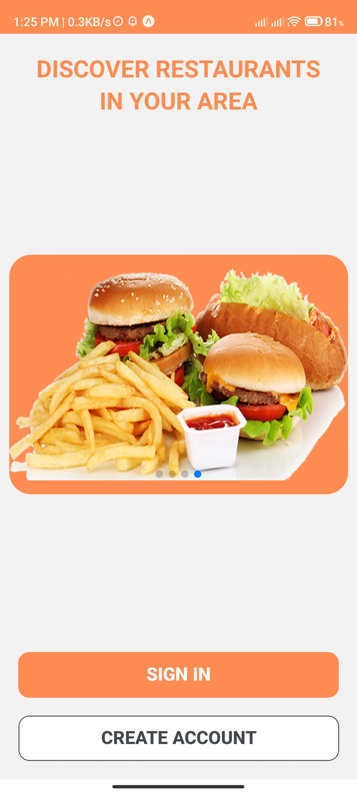
    
    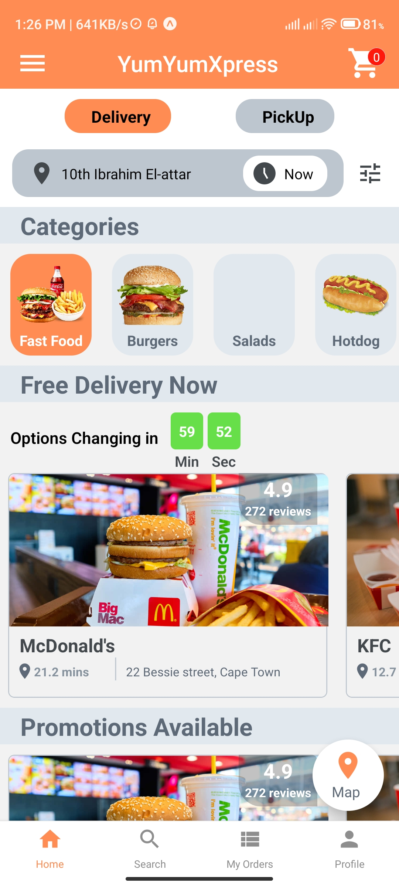
  

  

    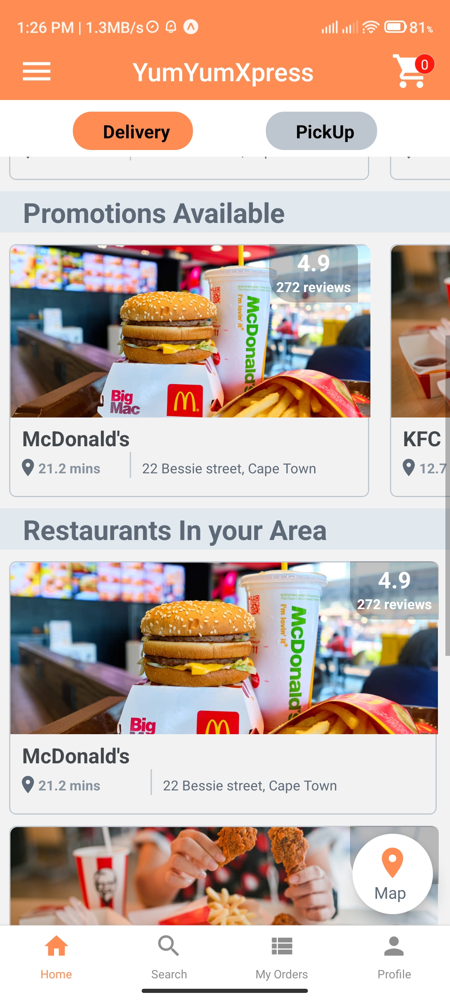
    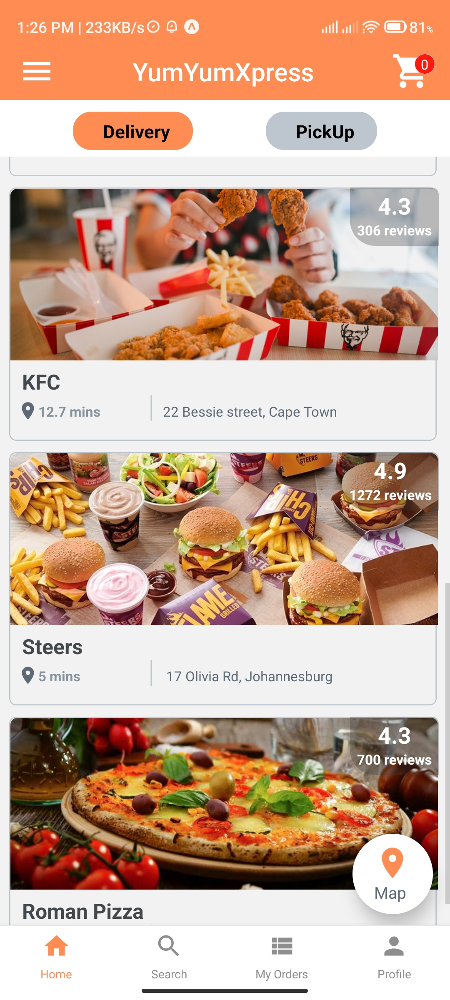
    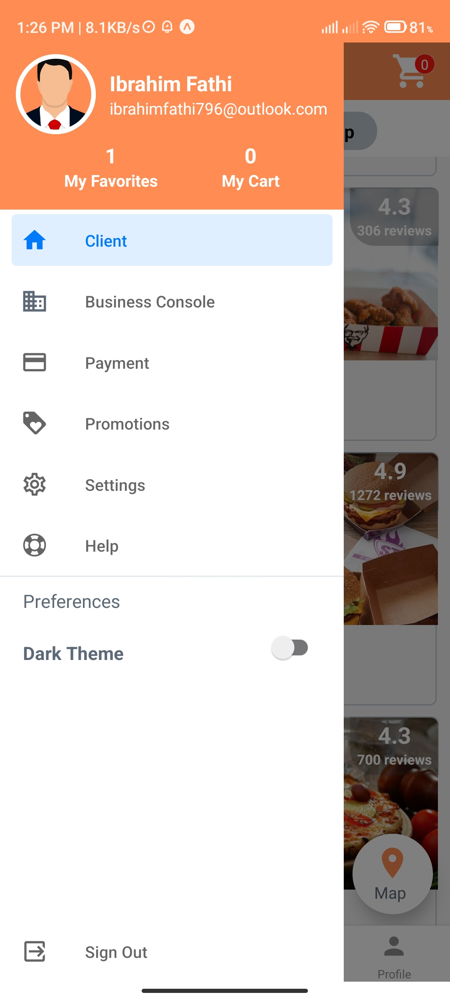
    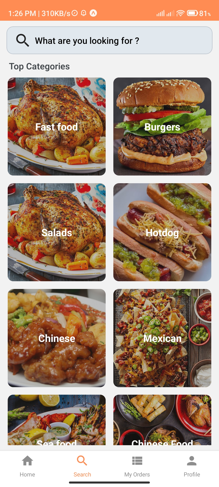
  

  

    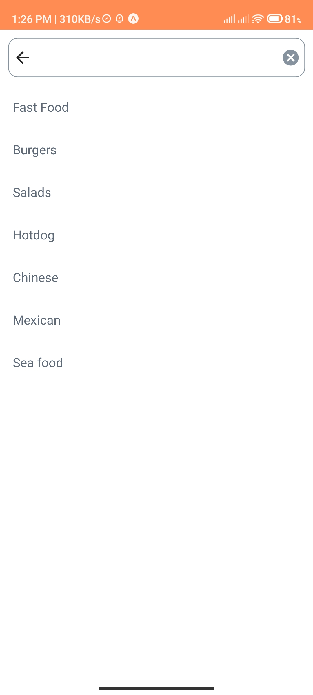
    
    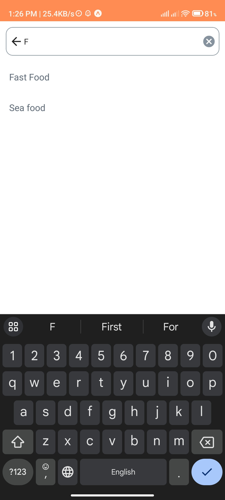
    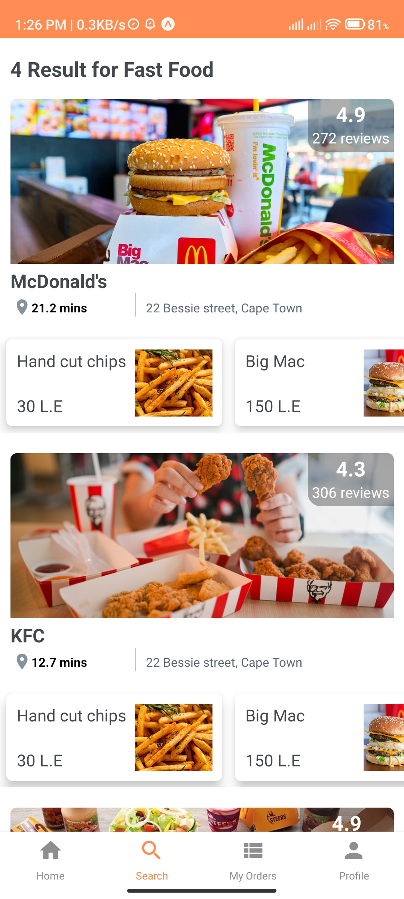
  

  

    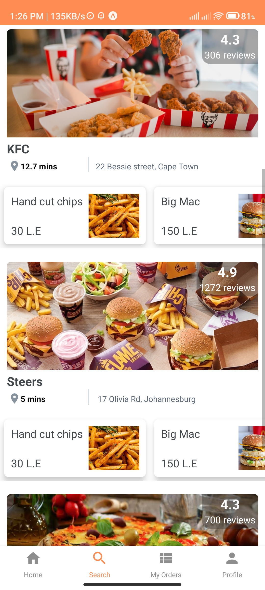
    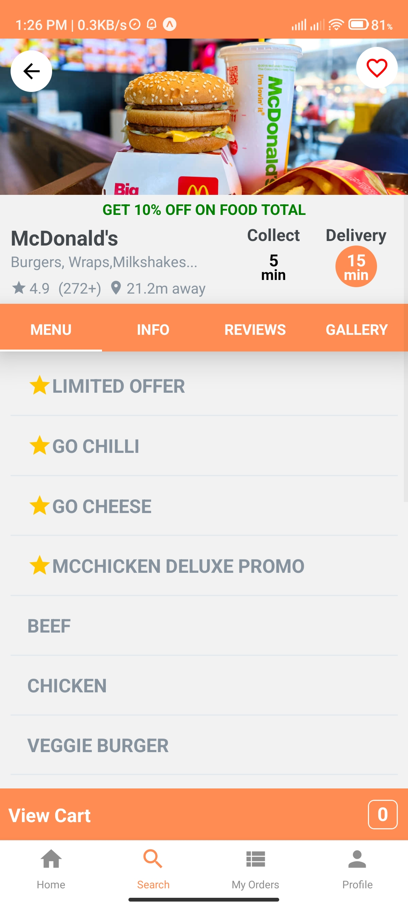
    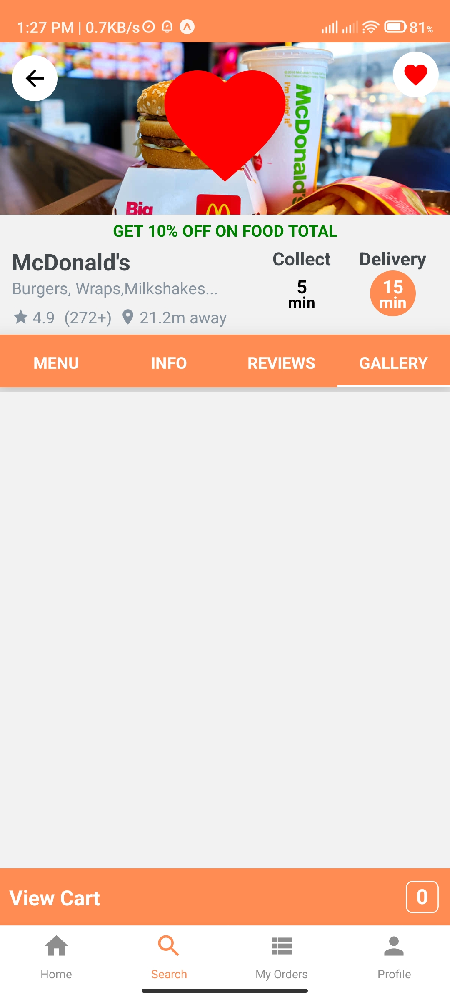
    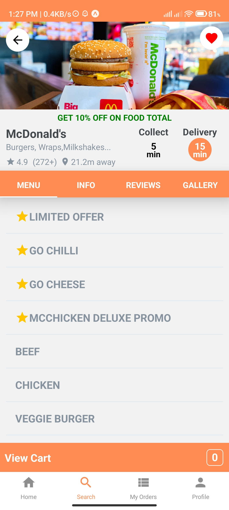
  

  

    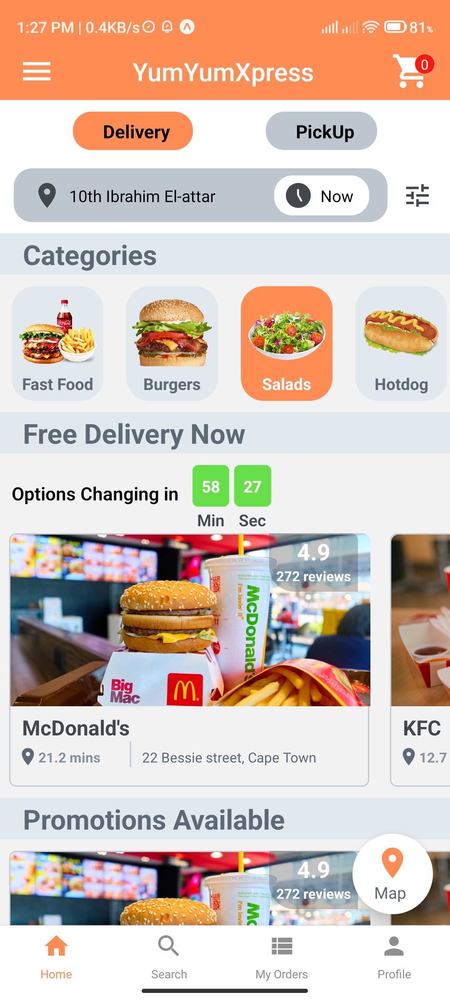
    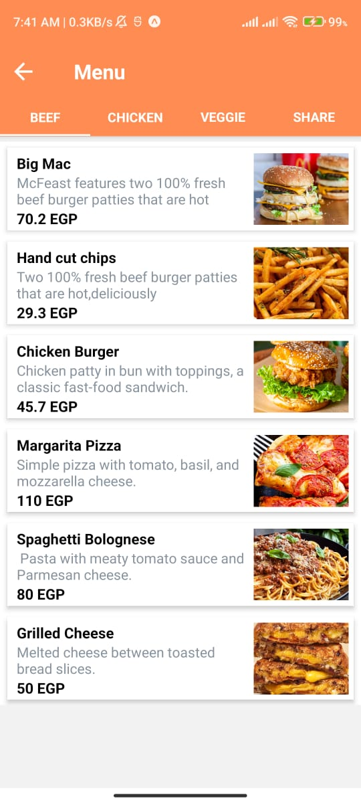
  

###

<h2 align="left">Video Of the Application</h2>

###

https://drive.google.com/file/d/1LzBShQXkAGABzf6-HYVBDne7bzK3yWZH/view?usp=share_link

###

###

<h2 align="left">Techs Used in this application:</h2>

###

  
  
  
  
  
  
  
  
  
  
  
  
  

###
